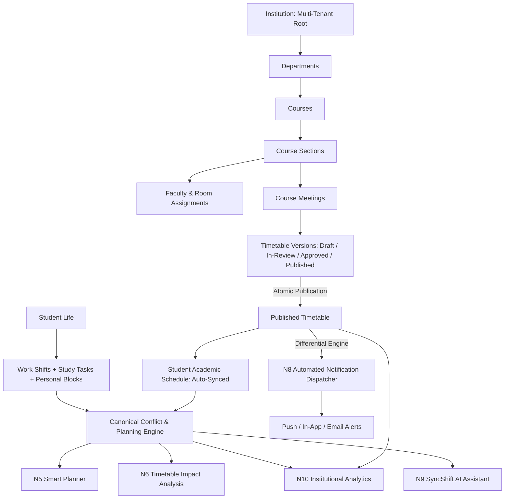

# SyncShift

> **"Connect the university timetable with real student life."**

SyncShift is a modern, unified scheduling platform designed for higher-education institutions and the modern students who attend them. It bridges the gap between authoritative university academic timetables and the chaotic realities of real student life—including jobs, shifts, study commitments, commuting, and personal obligations.

---

## 📌 The Problem

1. **Disconnected Academic Timetables:** Universities publish schedules across static PDFs, portal feeds, or disjointed registration systems. When timetables change, students often miss updates or scramble to rearrange their lives.
2. **The Working Student Dilemma:** Over 60% of modern undergraduate students work part-time or full-time jobs. Work schedules, commutes, and study deadlines regularly clash with sudden room changes, section moves, or exam periods.
3. **Blind Administration:** University administrators build and publish timetables in an administrative silo—unaware of how moving a lecture from Tuesday morning to Thursday evening creates severe job conflicts or impossible back-to-back commutes for hundreds of enrolled students.

---

## 💡 The Solution

SyncShift unifies **University Operations** and **Student Scheduling** under a single cohesive, multi-tenant architecture:

- **For Universities:** Comprehensive resource management (departments, courses, sections, rooms, faculty), visual draft editing, atomic multi-version release workflows, **instant student impact analysis**, and privacy-preserving cohort analytics.
- **For Students:** Authoritative auto-synced class enrollments combined with personal shift rosters, study tasks, and personal blocks; **smart heuristic planning** to auto-reconcile conflicts; instant push/in-app notifications when academic timetables change; and an in-app **AI Assistant** ("Ask SyncShift") grounded in institutional data.

---

## 🌟 Core Feature Matrix

### 🎓 For Students ("Plan classes, work, and life in one schedule")
- **Unified Calendar:** Combines authoritative university lectures/labs with personal work shifts, study sessions, and social time.
- **My Courses & Academic Status:** Direct visibility into enrolled sections, instructors, room assignments, and academic term dates.
- **Smart Planner (N5):** Heuristic optimization engine that recommends conflict-free study allocations, preserves travel buffers, respects shift commitments, and ensures healthy rest intervals.
- **Real-Time Timetable Sync & Alerts (N8):** Immediate notification when a room is relocated, faculty changes, or a class is rescheduled.
- **Ask SyncShift Assistant (N9):** Natural-language schedule Q&A with strict role enforcement and read-only student tenant isolation.

### 🏛️ For Universities ("Build better timetables and understand their impact on students")
- **Academic Resource Foundation (N1, N2):** Complete data hierarchy: Institutions → Departments → Courses → Sections → Faculty Assignments & Room Allocations.
- **Multi-Version Timetable Lifecycle (N4, N7):** Explicit drafts, review submissions, administrative approvals, and atomic publish workflows. Drafts are fully isolated from student schedules until published.
- **Timetable Editor & Impact Analysis (N6):** Drag-and-drop / slot-level adjustments with instant pre-publication simulation showing exact student shift conflicts, faculty double-bookings, and room overcapacity.
- **Automated Differential Notification Engine (N8):** Computes precise diffs upon publication (`CLASS_MOVED`, `CLASS_ROOM_CHANGED`, `CLASS_FACULTY_CHANGED`) and dispatches targeted alerts exclusively to affected cohorts.
- **Institutional Decision Dashboard & Analytics (N10):** Aggregate metrics on room utilization, peak hour congestion, student conflict heatmaps, and attendance risks without exposing individual private shifts.

---

## 🏗️ Canonical Architecture



---

## 🔒 Security & Privacy Architecture (N11 Hardened)

SyncShift enforces enterprise-grade security standards across every boundary:

1. **Strict Multi-Tenant Isolation:** Database queries and API dependencies strictly scope data by `institution_id`. Tenant hopping via IDOR is systematically blocked and tested.
2. **Role-Based Access Control (RBAC):** Hierarchical permissions (`student`, `professor`, `admin`, `super_admin`) enforced via FastAPI dependencies.
3. **Student Privacy Guardrails:** Personal shifts and private blocks are protected from administrator surveillance. University analytics compute only anonymized, aggregate metrics.
4. **Governed AI Architecture:** The assistant runs over deterministic internal tools with system prompts enforcing tenant boundaries, read-only permissions, and confirmation requirements for mutations.
5. **Robust File & Payload Validation:** Magic-byte sniffing, size limits, and sanitization prevent malicious upload injection.

---

## 🛠️ Tech Stack

| Domain | Technology | Description |
| :--- | :--- | :--- |
| **Frontend Framework** | **Next.js 16 (App Router)** | React 19, TypeScript, Turbopack, SSR & Static Optimization |
| **Styling & Design** | **Tailwind CSS + CSS Variables** | Curated dark/light themes, accessible tokens, smooth micro-interactions |
| **State & Fetching** | **React Context + Native Fetch** | Lightweight, responsive client-side caching with optimistic UI |
| **Backend API** | **FastAPI (Python 3.11+)** | High-performance async REST API with Pydantic v2 validation |
| **Database ORM** | **SQLAlchemy 2.0 + Alembic** | Strictly typed relational schema with 17 tracked migration revisions |
| **Database** | **PostgreSQL / SQLite** | SQLite for rapid local development/testing; PostgreSQL for production |
| **AI Integration** | **Google Gemini API** | Function-calling LLM architecture integrated with deterministic services |
| **Testing Suite** | **Pytest + Next.js Build Check** | 194 automated backend tests + strict frontend compilation & lint |

---

## 🚀 Getting Started

### Prerequisites
- **Node.js**: v18.18+ or v20+
- **Python**: v3.11, 3.12, or 3.13
- **Git**

---

### Quick Start (Local Development)

#### 1. Clone the repository
```bash
git clone https://github.com/HarshChaudhary-cyber/SyncShift.git
cd SyncShift
```

#### 2. Configure Backend
```bash
cd backend

# Create virtual environment
python -m venv .venv

# Activate virtual environment
# Windows:
.venv\Scripts\activate
# macOS/Linux:
source .venv/bin/activate

# Install dependencies
pip install -r requirements.txt

# Run migrations to initialize database
alembic upgrade head

# Seed realistic demo data (Northbridge University ecosystem)
python seed_demo_data.py

# Start FastAPI development server
uvicorn app.main:app --reload --host 127.0.0.1 --port 8000
```
Backend API will be live at `http://127.0.0.1:8000`. Interactive Swagger documentation: `http://127.0.0.1:8000/docs`.

#### 3. Configure Frontend
Open a new terminal:
```bash
cd app

# Install dependencies
npm install

# Start Next.js development server
npm run dev
```
Frontend application will be live at `http://localhost:3000`.

---

## 🎭 Demo Personas & Portfolio Walkthrough

The project includes an idempotent seed script (`backend/seed_demo_data.py`) setting up **Northbridge University (NBU)**:

| Persona | Email | Password | Role / Details |
| :--- | :--- | :--- | :--- |
| **University Administrator** | `admin@northbridge.edu` | `Northbridge2026!` | Admin: Manages timetable, reviews impact, publishes updates, views analytics. |
| **Student (Alex Taylor)** | `alex.taylor@student.northbridge.edu` | `Student2026!` | 3rd-year CS student. Works Tue/Thu barista shifts. Enrolled in CS301 & CS302. |
| **Student (Jordan Lee)** | `jordan.lee@student.northbridge.edu` | `Student2026!` | 3rd-year IT student. Works campus shifts. Enrolled in CS301 & IT305. |

### Flagship Portfolio Demonstration Flow

1. **Log in as Admin (`admin@northbridge.edu`):**
   - Navigate to **Timetable** (`/university/timetables`).
   - Open the active timetable and create a new **Draft Version** (v1.1).
   - Move `CS301-A` from Monday 09:00 to Tuesday 17:00.
   - Run **Impact Analysis**: See immediate flags that Alex Taylor's barista work shift collides with the new lecture slot.
   - Submit for review, approve, and **Publish**.
2. **Log in as Student (`alex.taylor@student.northbridge.edu`):**
   - Notice the **Notification Bell** alert: *"Fall 2026 Timetable Released / Class Moved"*.
   - View **My Schedule** (`/calendar`): The official university class is updated; the barista work shift remains intact.
   - Navigate to **Plan** (`/planner`): Run the smart optimizer to receive a conflict-free study schedule adapting to the change.
   - Open **Ask SyncShift** (✨ floating assistant) and ask: *"What classes do I have tomorrow?"* or *"Do I have any conflicts this week?"*
3. **Review Institutional Analytics (`/university/insights`):**
   - View aggregate classroom utilization rates, term registration progress, and student conflict density heatmaps.

---

## 🧪 Testing & Quality Assurance

SyncShift includes comprehensive automated test coverage for backend services, security hardening, and frontend build verification:

```bash
# Run backend test suite (194 tests)
cd backend
.venv\Scripts\activate
pytest -k "not live" -W ignore

# Run frontend production build (Turbopack + TypeScript validation)
cd ../app
npm run build

# Run frontend linting
npm run lint -- --quiet
```

### Test Suite Summary:
- ✅ **University Foundation & Resources (N1, N2):** Institutions, departments, rooms, terms, courses, sections.
- ✅ **Student Academics & Constraints (N3):** Profiles, enrollments, preferences, availability.
- ✅ **Baseline Timetables & Lifecycles (N4, N7):** Drafts, reviews, approvals, atomic publishing.
- ✅ **Smart Planning & Conflict Algorithms (N5):** Heuristic scheduling, buffer calculations, task allocation.
- ✅ **Impact Analysis Engine (N6):** Pre-publication simulation of student conflicts, room double-booking, overcapacity.
- ✅ **Automated Timetable Notifications (N8):** Differential computation, notification deduplication, batch delivery.
- ✅ **AI Assistant Integration (N9):** Tool execution, prompt sanitization, permission enforcement.
- ✅ **Institutional Decision Analytics (N10):** Real data aggregation, utilization metrics, risk scoring.
- ✅ **Security Hardening (N11):** Multi-tenant isolation, IDOR prevention, RBAC enforcement, file upload security.

---

## 📂 Project Structure

```
SyncShift/
├── README.md                      # Canonical portfolio documentation
├── SYNCshift_PROJECT.md           # High-level architecture & milestone tracking master
├── start.bat / start.sh           # One-click multi-service launch scripts
│
├── backend/                       # FastAPI Backend
│   ├── alembic/                   # Alembic database migrations (17 versions)
│   ├── seed_demo_data.py          # Northbridge University seed generator
│   └── app/
│       ├── config.py              # Environment configuration & settings
│       ├── dependencies.py        # Auth & tenant resolution dependencies
│       ├── main.py                # Application entrypoint & middleware
│       ├── models/                # SQLAlchemy ORM models (Timetable, User, Block, etc.)
│       ├── routers/               # API endpoints (Auth, Timetables, Assistant, Analytics, etc.)
│       ├── schemas/               # Pydantic v2 validation schemas
│       └── services/              # Pure business logic (Conflict, Planning, AI, Analytics)
│
└── app/                           # Next.js Frontend (App Router)
    ├── app/                       # Application route tree
    │   ├── (auth)/                # Login & registration views
    │   ├── calendar/              # Unified student schedule week view
    │   ├── planner/               # Smart study planner interface
    │   ├── student/               # Student academic course enrollments
    │   ├── university/            # Institutional portal (Timetables, Resources, Insights)
    │   └── notifications/         # Notification inbox
    ├── components/                # Reusable UI components & modals
    │   ├── assistant/             # SyncShift AI Assistant drawer & chat interface
    │   ├── calendar/              # Interactive week calendar components
    │   └── university/            # Timetable grid editor & publish modals
    ├── context/                   # React authentication & theme contexts
    └── lib/                       # API client, date utilities, and time helpers
```

---

## 🔮 Scope & Real-World Boundaries

SyncShift is an advanced portfolio platform demonstrating deep engineering rigor. In keeping with honesty and software integrity:
- **SIS/ERP Co-existence:** SyncShift is designed to consume from and integrate with university Student Information Systems (SIS); it does not replace core registrar tuition billing or graduation audit systems.
- **Deterministic AI:** The AI Assistant relies strictly on deterministic backend tools for schedule facts. SyncShift does not allow generative AI to perform unvalidated database writes.
- **Privacy First:** Student personal work shifts are strictly confidential and never visible to university administrators in raw detail.

---

## 📜 License

This project is licensed under the MIT License.
